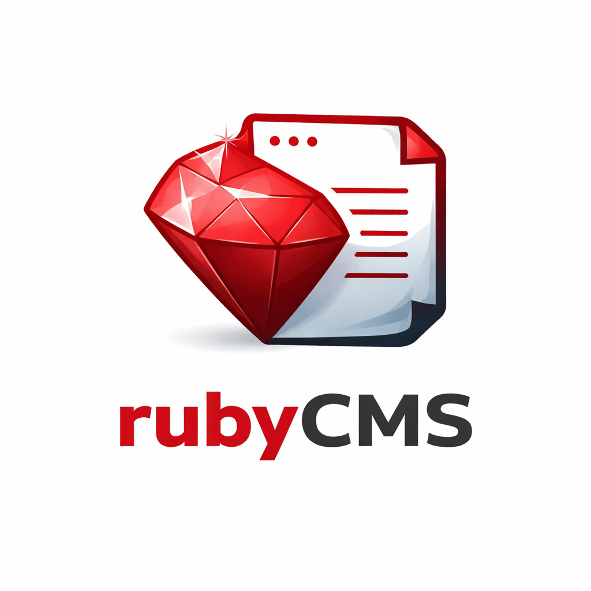

# RubyCMS



Reusable Rails engine for a CMS-style admin: permissions, admin UI shell, content blocks, and a visual editor.

Vision: your app owns product features (pages, models, business logic); RubyCMS manages content workflows and admin screens.

## Features

* Visual editor (inline editing for `content_block` regions)
* Content blocks (rich text + placeholders + list items)
* Permissions and users (admin access control)
* Visitor error tracking (`/admin/visitor_errors`)
* Analytics via Ahoy (page views + events)

## Quick Start

```bash
rails g ruby_cms:install
```

The generator sets up:

* `config/initializers/ruby_cms.rb`
* mounts the engine (`/admin/...` on the host app)
* migrations + RubyCMS tables
* seed permissions + initial admin setup

If your host app already has `/admin` routes, adjust/remove them so RubyCMS can use `/admin`.

## Using Content Blocks

In any view:

```erb
<%= content_block("hero_title", default: "Welcome") %>
<%= content_block("footer", cache: true) %>
```

<details>
<summary>Placeholders (attributes like `placeholder`, `alt`, meta tags)</summary>

`content_block` wraps output for the visual editor, so do not put it inside HTML attributes.
Use `wrap: false` (or `content_block_text`):

```erb
<%= text_field_tag :name, nil,
  placeholder: content_block("contact.name_placeholder", wrap: false, fallback: "Your name") %>

<%= text_area_tag :message, nil,
  placeholder: content_block_text("contact.message_placeholder", fallback: "Your message...") %>
```

</details>

<details>
<summary>List items (badges, tags, arrays)</summary>

Use `content_block_list_items` to get an Array:

```erb
<% content_block_list_items("education.item.badges", fallback: item[:badges]).each do |badge| %>
  <%= tag.span badge, class: "badge" %>
<% end %>
```

Store list content as JSON (`["Ruby", "Rails"]`) or newline-separated text in the CMS.

</details>

Create/edit blocks in **Admin -> Content blocks**.

## Visual Editor

Configure preview templates + (optional) preview data in `config/initializers/ruby_cms.rb`:

```ruby
c.preview_templates = { "home" => "pages/home", "about" => "pages/about" }
c.preview_data = ->(page_key, view) { { products: Product.limit(5) } }
```

Then open **Admin -> Visual editor**, pick a page key, and click content blocks in the preview.

## Admin UI Pages (custom admin templates)

RubyCMS exposes an `admin_page` helper:

```erb
<%= admin_page(title: "My Page", subtitle: "Optional") do %>
  <p>Hello from RubyCMS admin.</p>
<% end %>
```

## Visitor Error Tracking

Public (non-admin) exceptions are captured and shown in **`/admin/visitor_errors`**.

In development, logging is typically disabled and exceptions are re-raised normally.

## Page View Tracking (Ahoy)

Include `RubyCms::PageTracking` in public controllers:

```ruby
class PagesController < ApplicationController
  include RubyCms::PageTracking

  def home
    # @page_name can be set; defaults vary by controller
  end
end
```

## Seeding Content Blocks from YAML

If you want to import blocks from locales, set:

```ruby
c.content_blocks_translation_namespace = "content_blocks"
```

Example `config/locales/en.yml`:

```yaml
en:
  content_blocks:
    hero_title: "Welcome to my site"
```

Import:

```bash
rails ruby_cms:content_blocks:seed
```

## Common Rake Tasks

* `rails ruby_cms:seed_permissions`
* `rails ruby_cms:setup_admin`
* `rails ruby_cms:content_blocks:seed`
